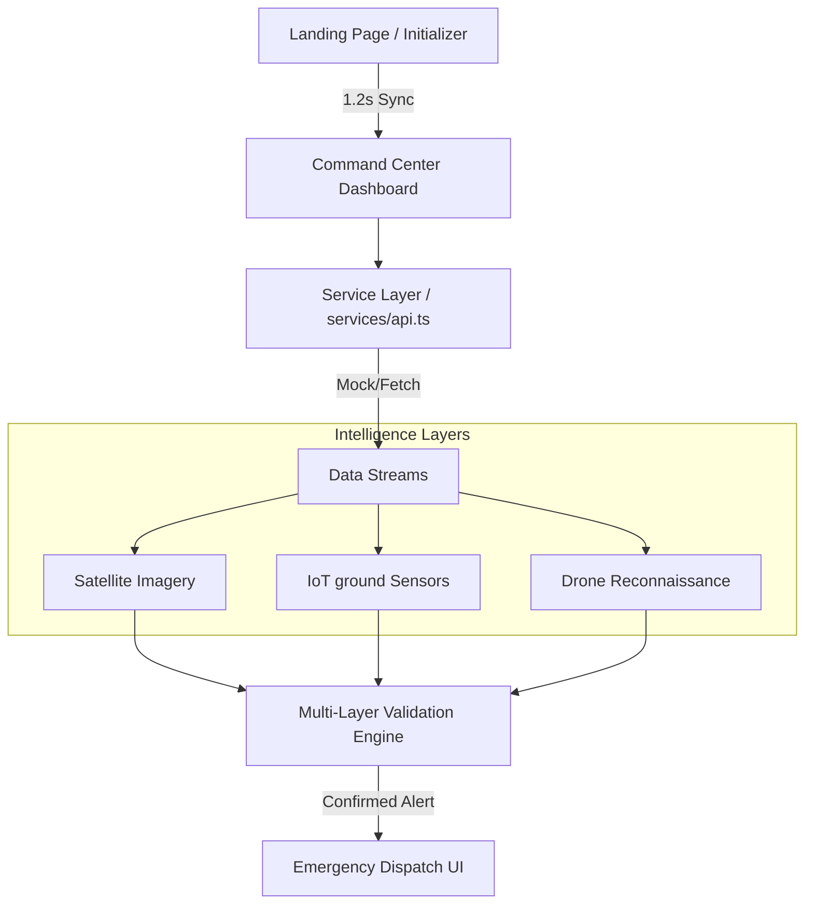

# 🌲 ForestWatch: Autonomous Fire Surveillance System
## ⚡ Developed by **404MANOVA**

**ForestWatch** is a next-generation dashboard for autonomous forest fire monitoring and emergency response coordination. By fusing data from **Satellite imagery**, **IoT ground sensors**, and **Drone surveillance**, the system provides a high-fidelity, cross-validated threat assessment to minimize response times and prevent ecological disasters.

---

## 🛰️ Architecture Overview
The system follows a modular, service-oriented frontend architecture built on **Next.js 16** and **TypeScript**.



---

## 🚀 Key Features

### 1. **Immersive 3D Command Bridge**
- **404MANOVA Initializer**: A cinematic 1.2-second satellite boot sequence that ensures all orbital and ground assets are synchronized before dashboard entry.
- **Geospatial Intelligence**: Interactive command map powered by Leaflet, visualizing high-risk zones, active monitoring nodes, and live threat radii.

### 2. **Multi-Layer Data Fusion**
- **Validation Engine**: Prevents false positives by cross-referencing satellite thermal data with IoT smoke/temperature sensors and drone visual confirmation.
- **Production-Ready Typing**: Strictly typed TypeScript interfaces for all telemetry data (IoTDevice, FireAlert, ThreatLevel).

### 3. **Impact Analytics**
- Real-time visualization of area burn estimates, severity trends, and resource deployment status via Recharts.

---

## 🛠️ Tech Stack
- **Framework**: [Next.js 16 (App Router)](https://nextjs.org/)
- **Language**: [TypeScript](https://www.typescriptlang.org/) (Strict mode)
- **Styling**: [Tailwind CSS](https://tailwindcss.com/)
- **Map Engine**: [React Leaflet](https://react-leaflet.js.org/)
- **Visualizations**: [Recharts](https://recharts.org/)
- **Icons**: [Lucide React](https://lucide.dev/)

---

## 📦 Getting Started

### Prerequisites
- Node.js 18.x or higher
- npm or yarn

### Installation
1. Clone the repository:
   ```bash
   git clone https://github.com/goutham-hegde/ForestWatch.git
   ```
2. Install dependencies:
   ```bash
   npm install
   ```
3. Start the development server:
   ```bash
   npm run dev
   ```
4. Build for production:
   ```bash
   npm run build
   ```

---

## 📂 Project Structure
```text
├── app/                  # Next.js App Router (Routes & Layouts)
│   ├── dashboard/       # Main Overview Dashboard
│   ├── map/             # Geospatial Command Center
│   ├── validation/      # Multi-Layer Confirmation Engine
│   └── page.tsx         # 404MANOVA Landing Page
├── components/           # Reusable UI Components
├── services/             # API & Data Fetching Layer
├── types/                # Centralized Type Definitions
└── public/               # Static Assets (Images/Icons)
```

---

## 🤝 The Team
**Team 404MANOVA** - *Advanced Surveillance Division*
- Specializing in high-fidelity data fusion and autonomous monitoring solutions.

---

*Verified for Production Build: April 16, 2026*
